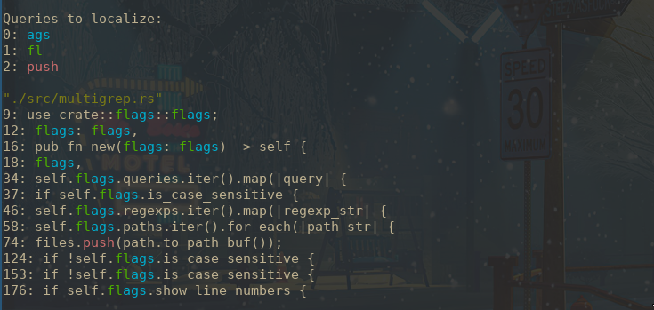

# Multigrep

Multigrep is a Rust program that allows searching for queries and regex patterns in utf-8 encoded files. It can search for the queries in a specific file or folder recursively.



## Prerequisites

To build and use Multigrep, you'll need to have the following installed on your system:

- Rust 1.51 or higher
- Git

## Installation

To install Multigrep, follow these steps:

1. Clone the Git repository:

```bash
git clone https://github.com/your-username/multigrep.git
cd multigrep
```
2. Build the program using the included build.sh script:

```bash
./build.sh
```

This will compile the program and install it to your system's /usr/local/bin directory. You may be prompted to enter your password to authorize the installation.

## Features

Multigrep has the following features:

* Search for one or more queries or regex patterns in utf-8 encoded files
* Search in a specific file or folder recursively
* Highlight matches in a different color for each query or pattern
* Show the line number of each match
* Ignore case when searching

## Usage

You can run Multigrep by executing the binary file generated by the Rust compiler. Here's how to do it:

1. Open a terminal window
2. Navigate to the folder where Multigrep is located
3. Run the following command:

## Output

When you run Multigrep, it will show a list of the queries to localize, with each query highlighted in a random color. Then, for each file that contains a match, it will display the file name and all the lines that have a match, with the query matched highlighted in the color shown in the initial list.

Multigrep will keep searching until it has read all the files in the specified directory and its subdirectories.

## Examples

Here are some examples of how to use Multigrep:

### Search for multiple queries

```bash
multigrep --query "foo" "bar" --path "/path/to/files"
```

### Search for regex patterns

```bash
multigrep --regexp "foo.+bar" "ap\S*\(" --path "/path/to/files"
```

### Search for a queries, regex and show the line number of the matches

```bash
multigrep --query "foo" "bar" --regexp "foo.+bar" --path "/path/to/files" --number-line
```

## License

This project is licensed under the MIT License. See [LICENSE](https://github.com/alejandromc23/multigrep/blob/master/LICENSE) for more information.

## Contributing

Contributions are welcome! Please feel free to submit issues or pull requests
